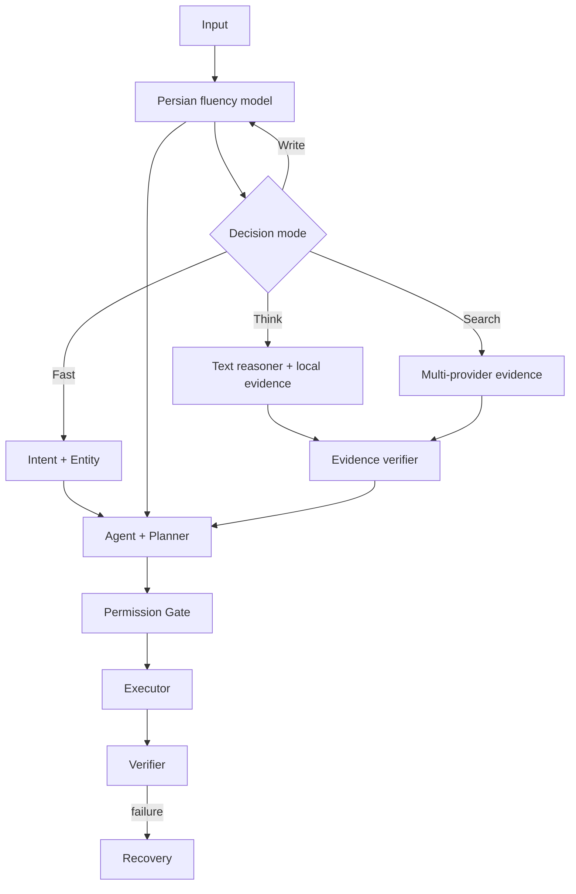

# JARVIS v0.11.0 Architecture

## Runtime flow

Startup: Config → Hardware/CPU fallback → SQLite Memory → Personality → Fast Brain → Smart metadata lazy → Knowledge/RAG/Extensions → Permission-aware Tools → Agent → GUI. خرابی Smart weight به Warning تبدیل می‌شود و GUI/Fast Brain را متوقف نمی‌کند.

## Boundaries

| بخش | مسیر | مسئولیت |
|---|---|---|
| Brain | `jarvis/brain`, `jarvis/neural` | Fast classifier، Transformer، Tokenizer، Quality Gate |
| Agent | `jarvis/agent` | Query analysis، Persian Fluency، Dialogue Subject، grounded deliberation، Context، Plan، Execute، Verify، Recover |
| NLU | `jarvis/nlu`, `jarvis/entities` | Polarity، typo، Intent، Entity، reference و workflow |
| Memory | `jarvis/memory` | Working/Episodic/Semantic، session و action history |
| RAG | `jarvis/knowledge` | 97 سند builtin، Index، BM25، hashed vector، rerank و source |
| Search | `jarvis/search`, `jarvis/research` | Provider fusion، page extraction، passage rank، corroboration، citation |
| Tools | `jarvis/tools` | Capability Registry و implementation محدود |
| Extensions | `jarvis/skills`, `jarvis/plugins` | Manifest discovery/validation |
| Runtime | `jarvis/runtime` | Bootstrap، Hardware، App Index، Diagnostics |
| UI | `jarvis/gui`, `jarvis/lab` | CustomTkinter Chat RTL/LTR-aware و Training/Evaluation Studio |

## Fast and Smart brains

Fast Brain یک MLP/Unicode-hash embedding با 2,106,645 پارامتر و lexical ensemble است. Smart Brain یک Decoder-only Transformer با 23,077,376 پارامتر است و فقط در مسیر تولیدی Load می‌شود. Safety polarity و Tool validation عمداً deterministic هستند.

Smart inference از KV cache استفاده می‌کند. Matrixهای INT8 مقیم می‌مانند و فقط activation/embedding row لازم FP32 می‌شود. RAM وزن از 88.033MB به 22.017MB رسیده است. روی NumPy میزبان، INT8 از BLAS FP32 کندتر بود؛ Default بر پایهٔ کمبود RAM است و Fast Brain اغلب Smart path را دور می‌زند.

## Persian fluency path

`PersianFluencyEngine` یک classifier آموزش‌دیدهٔ واژه/سه‌نویسه برای هفت کلاس text، formal message، caption، story، advice، support و rewrite دارد. Composer فقط برای درخواست نوشتاری یا حمایتی فعال می‌شود و سؤال واقعیِ تازه را از Search منحرف نمی‌کند. خروجی باید محدودیت طول، یکدستی حروف فارسی، نبود token کنترلی و نبود تکرار جمله را پاس کند. این لایه مدل عمومی یا جایگزین Smart Brain نیست؛ یک تخصص‌دهی کم‌هزینه و قابل‌آزمون برای فارسی است.

## Deliberation and answer policy

`QueryAnalyzer` زبان، نوع سؤال، تازگی، volatility، متن supplied، چندسؤالی‌بودن و ambiguity را ثبت می‌کند. `TextReasoner` برای متنِ خود کاربر extractive QA/summarization انجام می‌دهد و برای گزاره‌های صریح «همه Aها B هستند؛ x یک A است» closure محدود می‌سازد. `EvidenceVerifier` باید overlap پاسخ با evidence را تأیید کند. جزئیات داخلی استدلال به کاربر نمایش داده نمی‌شود؛ فقط پاسخ، confidence و checkهای سطح‌بالا ثبت می‌شوند.

ترتیب پاسخ اطلاعاتی:

1. متن صریح پیام، attachment یا reference معتبر به پیام قبلی
2. Knowledge/RAG محلی
3. Web Search اختیاری برای سؤال تازه یا کمبود شواهد
4. UNKNOWN/clarification در صورت نبود evidence

Smart Brain حق پرکردن شکاف دانشی با نثر محتمل‌نما را ندارد. Quality Guard علاوه بر repetition و token leakage، prompt echo، duplicate phrase، sentence completeness، language consistency و character distribution را بررسی می‌کند.

## Dialogue subject continuity

`DialogueSubjectResolver` یک موضوع اطلاعاتی صریح مانند «لیونل مسی» را از درخواست تحقیق استخراج و در `TaskContext` ثبت می‌کند. follow-up کوتاهی که موضوع تازه‌ای ندارد، پیش از Route شدن با همان موضوع annotate می‌شود. موضوع و حالت ترجمه فقط یک نوبت معتبر می‌مانند؛ پس یک سؤال میانی Context ضمیری را منقضی می‌کند. Topic فقط در مسیر اطلاعات/Search/Research استفاده می‌شود و دستور Desktop یا سؤال صریح دربارهٔ موجودیت تازه را آلوده نمی‌کند. Search subject lock حضور termهای موضوع را در result و passage بررسی می‌کند؛ نبود تطابق به `insufficient` می‌رسد، نه حدس.

## Trained follow-up and fact memory

`FollowupIntentModel` یک مدل TF-IDF واژه/سه‌نویسه و centroid است که از artifact محلی `dialogue_followup_v10.json` بارگذاری می‌شود. هشت کلاس example، summary، plural، sentence، rewrite، remember، recall و standalone را جدا می‌کند. Ruleهای قطعی برای درخواست‌های کامل و Context TTL کنار مدل قرار دارند تا confidence متوسط باعث اتصال خطرناک به پاسخ قدیمی نشود. آخرین پاسخ قابل‌استفاده در Context همان Session با شمارهٔ نوبت نگه‌داری می‌شود، نه در Fact دائمی.

Factهای صریح کاربر با کلید namespaceدار `user_fact:` ذخیره می‌شوند. مقدار اصلی برای حفظ Case لاتین باقی می‌ماند و label فارسی برای بازیابی نرمال می‌شود. سؤال ناقصِ بدون Context معتبر clarification محلی می‌گیرد و به Search فرستاده نمی‌شود.

## Planner, verifier and recovery

Plan شامل Stepهای typed و ToolCall structured است. referenceهایی مثل `$ref: step1.items.0.path` فقط از خروجی قبلی resolve می‌شوند. Verifier postcondition را بررسی می‌کند؛ نبود Exception به‌تنهایی success نیست. Recovery فقط alternativeهای whitelist‌شده را امتحان می‌کند.

## Permission and transactions

ToolSpec شامل category، required/optional arguments، risk، semantic action و entity type است. L2-L4 confirmation می‌گیرند. Pending confirmation TTL دارد. Dry Run فقط Plan/Preview است. Action reversible با inverse tool/arguments در SQLite ثبت می‌شود و Undo خود Confirmation می‌گیرد.

## Memory

- Working: context محدود process و پیام‌های اخیر
- Episodic: summary، session، salience و timestamp
- Semantic: factهای versioned با conflict counter
- Action history: tool/result/inverse/undo state

SQLite از WAL، foreign key، parameterized query، schema v4 و migration idempotent استفاده می‌کند. Consolidation conflict را ثبت و retention رشد را محدود می‌کند.

## RAG

Chunkها در SQLite هستند. Score نهایی ترکیب BM25، cosine روی Unicode n-gram hash و rerank overlap/phrase است. Embedding یا vocabulary خارجی وجود ندارد. Source و سه score در Hit می‌مانند.

## Web evidence pipeline

`InternetTool.search_detailed` سه مسیر مستقل را موازی اجرا می‌کند:

- DuckDuckGo HTML با fallback به Lite و URL redirect normalization
- MediaWiki Action API روی `fa.wikipedia.org` یا `en.wikipedia.org`
- Bing RSS به‌عنوان fallback مستقل و بدون parser وابسته به layout

`SearchEngine` نتیجه‌ها را cache کوتاه، URL-normalize، deduplicate و با query coverage + title + source quality رتبه‌بندی می‌کند. برای resultهای بدون متن، حداکثر سه domain برتر به‌صورت bounded خوانده می‌شوند. HTML navigation/script/form حذف می‌شود. هر passage شامل source index و URL است؛ corroboration فقط میان domainهای متفاوت محاسبه می‌شود. `ResearchEngine` فقط passageهای انتخاب‌شده را به یک پاسخ ساختاریافته تبدیل و citationها را مجدداً شماره‌گذاری می‌کند. سؤال‌های volatile cache کوتاه‌تر و confidence محافظه‌کارانه‌تری دارند. تمام Provider errorها در `search.jsonl` ثبت می‌شوند و failure به جواب جعلی تبدیل نمی‌شود.

## Skills and plugins

Skill manifest declarative و وابسته به Toolهای موجود است. Plugin manifest validate می‌شود، اما entrypoint اجرایی بدون signing/sandbox Load نمی‌شود؛ status و reason واقعی گزارش می‌شوند.

## Threading and data

GUI درخواست را به queue/worker می‌فرستد و فقط `root.after` Widget را تغییر می‌دهد. Stop یک cancel event مشترک را به Agent، decoder و CommandRunner می‌رساند. State کاربر برای سازگاری در `%LOCALAPPDATA%\Jarvis_v0.7` یا `JARVIS_DATA_DIR` است. وقتی Memory خاموش باشد متن Chat، argument ابزار، query تحقیق و failure sample روی دیسک ثبت نمی‌شود.
