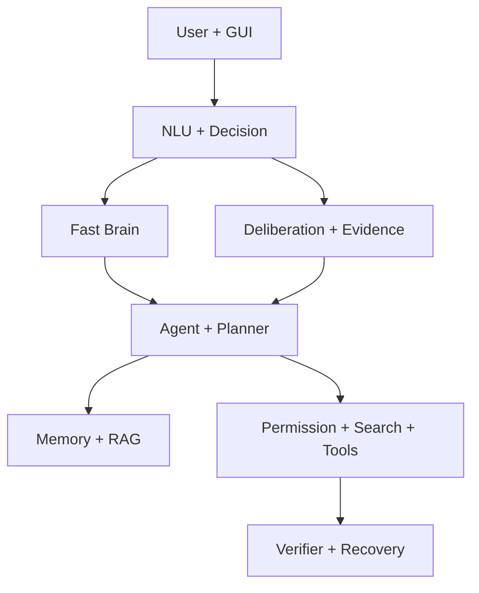

> **نسخهٔ فعلی: v21** — مسیر Runtime، نتایج آموزش و محدودیت‌های این بسته در [V21_README_FA.md](V21_README_FA.md) است. توضیحات نسخه‌های قبلی در ادامه تاریخی‌اند.

> **نسخهٔ این بسته: Intelligence v20.1 / Runtime 2.0.1.** اصلاح تطبیق منبع و Slot و درخواست جملهٔ nام؛ راهنما و محدودیت‌های فعلی در [V20_1_README_FA.md](V20_1_README_FA.md). مطالب نسخه‌های قبلی در ادامه، تاریخی‌اند.

# JARVIS v0.11.0 — Bilingual Trained Local Desktop Agent

JARVIS v0.11.0 یک Agent دسکتاپ محلی، فارسی/انگلیسی، CPU-first و قابل‌گسترش است. Runtime اصلی بدون سرویس ابری یا API مدل کار می‌کند. این نسخه تولید متن دوزبانه، تشخیص مهارت شناختی، دانش عمومی و تحقیق وب را ارتقا می‌دهد و همچنان حافظهٔ Fact و Context زمان‌دار نسخهٔ قبل را حفظ می‌کند.

> **Intelligence v15 final:** این بسته شامل Semantic Router یادگرفتنی، Runtime Reasoning/Code/Constraint v15 و `dataset_v007` با 36,530 نمونه است. 21,800 نمونهٔ جدید v15 در Generalization، Reasoning، Persian Fluency، Routing و Constraint Following اضافه شده و fallback کم‌اطمینان قبل از `unknown/web` اصلاح شده است. برای اعداد دقیق و benchmark مستقل، `V15_RELEASE_NOTES.md` و `RELEASE_V15_FINAL.json` را ببینید.

معماری Hybrid شامل Fast Brain برای Intentهای سریع و Smart Brain اختصاصی 23M برای تولید زبانی است و NLU، Memory، RAG، Planner، Verifier، Recovery و Permission Layer را ترکیب می‌کند. Smart Brain به‌صورت Lazy Load است؛ دستور ساده‌ای مثل تنظیم صدا وزن مدل را Load نمی‌کند.

دو مدل مکمل پروژه‌ساخته با Train/Holdout جداگانه فعال‌اند: Bilingual Fluency روی ۱۰۵ نمونه و Cognitive Skills روی ۹۶ نمونه. پاسخ‌های احتمال، ساعت، فاکتوریل، دنباله، روز نسبی و منطق مجموعه‌ها با حل‌گرهای قطعی کنترل می‌شوند. جست‌وجو از DuckDuckGo، Wikipedia و Bing RSS استفاده می‌کند، منابع اجتماعی نامرتبط را حذف و برای تحقیق چند Query، شواهد را میان بازنویسی‌ها ادغام می‌کند.

## Installation

نیازمندی‌ها: Windows 10/11، CPython 3.13 شامل Tkinter، بدون نیاز به GPU.

```powershell
cd Jarvis_v0.11.0
py -3.13 -m pip install -r requirements.txt
py -3.13 main.py
```

یا محیط جدا:

```powershell
powershell -ExecutionPolicy Bypass -File .\setup.ps1
.\.venv-runtime\Scripts\Activate.ps1
python main.py
```

Runtime به `numpy` و کتابخانهٔ سبک `customtkinter` وابسته است؛ Tkinter، SQLite و ZIP از کتابخانهٔ استاندارد Python هستند. اجرای عادی هیچ Training یا Download انجام نمی‌دهد.

```powershell
python main.py --version
python main.py --self-test
python training_studio.py
python -m unittest discover -s tests -v
```

## Features

- مکالمهٔ پایهٔ فارسی/انگلیسی و Personalityهای Normal، Kind، Angry، Loti، Gang، Funny و Professional
- تولید موضوع‌محور متن فارسی، پیام رسمی، کپشن، داستان، توصیهٔ ساختاری و بازنویسی
- Intent/Action و Entityهای Path، Drive، Folder، File، URL، درصد و عدد فارسی
- تحمل محافظه‌کارانهٔ typo بدون تغییر Case نام فایل، URL، Path یا JSON
- Context چندپیامی، ضمیر، موضوع تحقیق، «همونجا» و Factهایی مثل نام کاربر
- مدل Follow-up فارسی با ۹۴ نمونهٔ بازبینی‌شده برای خلاصه، مثال، جمع واژه، جمله، بازنویسی و حافظه
- مدل Bilingual Fluency با ۱۰۵ نمونه برای متن، پیام رسمی، کپشن، داستان، توصیه، حمایت و بازنویسی در فارسی و انگلیسی
- مدل Cognitive Skills با ۹۶ نمونهٔ دوزبانه برای تشخیص محافظه‌کارانهٔ خانوادهٔ مسائل منطقی و کمی
- Factهای نام‌دار عمومی برای رمز، کد، شناسه، نام، شماره و آدرس با بازیابی پس از پیام‌های میانی
- Context کوتاه‌عمر برای جلوگیری از نشت موضوع یا ترجمهٔ قدیمی به سؤال جدید
- Planner چندمرحله‌ای با reference پویا به خروجی مرحلهٔ قبل
- Dry Run، Undo، تأیید عملیات حساس و ریسک L0 تا L4
- Memory سه‌سطحی Working/Episodic/Semantic روی SQLite/WAL
- RAG محلی Hybrid با BM25، بردار Hash‌شده و Rerank، بدون Embedding آماده
- تحلیل متن، پاسخ به چند سؤال روی یک متن و استنتاج منطقی چندمرحله‌ای محدود و Grounded
- حل محلی معماهای منطقی و مسائل پارامتری ساعت، فاکتوریل، احتمال دوجمله‌ای حداقل/حداکثر/دقیقاً، روز نسبی، مجموع/اختلاف و دنباله بدون جست‌وجوی وب
- خواندن محدود متن/کد و فهرست/خواندن ZIP بدون Extract کامل
- جست‌وجوی اختیاری سه‌منبعی با قفل موضوع، حذف Social/Low-value نامرتبط، ترجیح منبع رسمی، ادغام Evidence میان Queryها، citation و confidence
- ابزارهای فایل، سیستم، تشخیص/بستن Browser پیش‌فرض و Desktop Windows
- Tool/Skill/Plugin Registry؛ Plugin اجرایی بدون امضا Load نمی‌شود
- GUI Dark مبتنی بر CustomTkinter، Bubbleهای مدرن، Worker-thread و RTL واقعی با Action Viewer و CPU/RAM
- JARVIS LAB برای Dataset، Training، Evaluation، Model lifecycle و Failure Review

نمونه:

```text
سلام
اسم من یونس هست
اسمم چی بود؟
داخل درایو D یک فایل به نام تست بساز
فایل‌های PDF امروزی Downloads رو پیدا کن؛ حجیم‌ترینش رو ببر Desktop
dry run: create file D:\preview.txt
فرق TCP و UDP چیه؟
در مورد تلاش و پشتکار یک متن زیبا بنویس
یک پیام رسمی برای مشتری بنویس که سفارش فردا ارسال می‌شود
یک داستان کوتاه درباره امید بنویس
متن: علی فردا نمی‌آید چون بیمار است. چرا علی نمی‌آید؟
همه پرنده‌ها بال دارند و گنجشک پرنده است. چه نتیجه‌ای می‌گیری؟
list skills
diagnose system
```

سؤال آموزشی مانند «پاک‌کردن فایل در پایتون چطور انجام می‌شود؟» مجوز اجرای `delete_file` نیست.

## Architecture



جزئیات در [ARCHITECTURE.md](ARCHITECTURE.md) است.

## Model

| ویژگی Nano Release | مقدار |
|---|---:|
| معماری | Decoder-only Transformer، MHA، RoPE، SwiGLU، RMSNorm |
| پارامتر | 23,077,376 |
| لایه / d_model / FFN | 8 / 512 / 1,024 |
| Head / KV Head | 8 / 8 |
| Context / Vocabulary | 2,048 / 4,096 |
| فرمت | `jarvis-numpy-int8-v2` |
| فایل | `jarvis_nano_v08.npz` + `dialogue_adapter_v8.json` |
| Pretrained source | ندارد |

مدل مکمل `bilingual_fluency_v11.json` با ۱۰۵ نمونهٔ پروژه‌ساخته آموزش دیده است. مدل `cognitive_skills_v11.json` نیز ۹۶ نمونهٔ دوزبانه دارد و نوع مسئله را پیش از حل قطعی تشخیص می‌دهد. هر دو از TF-IDF واژه/سه‌نویسه و centroid استفاده می‌کنند و هیچ وزن pretrained ندارند؛ در نتیجه برای وظایف پوشش‌داده‌شده نیازی به Load شدن وزن 23M نیست.

Core با 82,201,344 و Pro با 252,228,608 پارامتر Config و Training Backend دارند، اما وزنشان bundled نیست و Registry صریحاً `config_only_not_bundled` می‌گوید.

Smart output از Quality Guard عبور می‌کند. توکن ساختاری، تکرار عبارت، prompt echo، زبان نامرتبط، جملهٔ ناقص، نویسهٔ خراب یا confidence پایین نمایش داده نمی‌شود و Agent به مسیر Grounded/Fast fallback می‌کند.

## Tokenizer

Tokenizer بایتی BPE-like از corpus پروژه آموزش دیده و برای فارسی، انگلیسی، Path ویندوز، URL، JSON، کد و عدد Round-trip کامل دارد. Candidateهای واقعی 2,048، 4,096 و سقف حاصل‌شدهٔ 4,657 بررسی شدند. Vocabulary 4,096 کوچک‌ترین گزینه در فاصلهٔ 6٪ بهترین Compression بود. OOV rate بایتی صفر است.

## Dataset and Training

`dataset_v003` شامل 5,529 نمونهٔ پروژه‌ساخته است: 4,583 Train، 535 Validation و 411 Test. Bilingual Fluency روی ۹۱ نمونه Train و ۱۴ نمونه Holdout ارزیابی شده و Cognitive Skills روی ۸۰ نمونه Train و ۱۶ نمونه Holdout. جزئیات در [TRAINING.md](TRAINING.md) است.

## Evaluation

- Nano، teacher-forced روی 411 Test: token accuracy `0.441933`، cross-entropy `3.882264`، perplexity `48.533978`.
- Agent روی suite ساختاری 1,000تایی unseen: exact-case `1.0` و error `0`. این suite چهار خانوادهٔ محدود است، نه معیار هوش عمومی.
- Fast Brain روی Test مستقل: hybrid accuracy `0.655914` و unknown recall `1.0`.
- Grounded Intelligence v0.7.1: تعداد `50/50` مورد curated شامل Text-QA، deduction، Knowledge، unsupported-claim guard و Search fixture. این عدد معیار سؤال آزاد اینترنت نیست.
- Context/Research/UI v0.7.2: تعداد `12/12` تست بازگشتی، شامل سناریوی دقیق «مسی ← چند گل؟»، حذف منبع اشتباه، URL تکراری، مرورگر پیش‌فرض و پاک‌سازی bidi.
- Persian Fluency v0.9: تشخیص `7/7` کلاس نگه‌داشته‌شده و پذیرش زبانی `7/7`؛ این مجموعه کوچک و وظیفه‌محور است.
- Bilingual Fluency v0.11: دقت Holdout برابر `14/14` و پذیرش تولید برابر `14/14` روی ۱۴ زیرگروه زبان/وظیفه.
- Cognitive Skills v0.11: دقت Holdout برابر `15/16` یا `93.75%` روی هشت خانوادهٔ مسئله؛ حل نهایی همچنان با الگوریتم قطعی انجام می‌شود.
- مجموعهٔ Unit/Integration/Security/Scenario قبل از Release کامل اجرا می‌شود؛ نتیجهٔ نهایی در CHANGELOG ثبت می‌شود.

Metricهای بدون دادهٔ معتبر `null` مانده‌اند؛ Conversation quality انسانی و Execution success روی Windows جعل نشده است. جزئیات در [BENCHMARK.md](BENCHMARK.md).

## Tools and Permissions

| سطح | نمونه | رفتار |
|---|---|---|
| L0 | اطلاعات و Diagnostics | Read-only |
| L1 | بازکردن App/URL | اجرای محدود |
| L2 | ساخت/نوشتن/جابجایی فایل | Preview + Confirmation |
| L3 | حذف | هشدار + Confirmation |
| L4 | Power/Command حساس | بالاترین محدودیت |

Command composition، Bulk delete، Path traversal، Private-network fetch و ZIP bomb محدودند. Undo فقط برای Action با inverse معتبر است؛ Dry Run Mutation نمی‌کند.

## Memory and RAG

Databaseها در `%LOCALAPPDATA%\Jarvis_v0.7` نگهداری می‌شوند و با `JARVIS_DATA_DIR` قابل تغییرند. Memory retention، max rows، consolidation، conflict tracking و forgetting دارد. RAG سند محلی را Chunk و با BM25 + hashed-vector + reranker جست‌وجو می‌کند و Source/score را حفظ می‌کند.

## Internet research

Chat اصلی بدون اینترنت کار می‌کند. برای سؤال تازه یا درخواست صریح جست‌وجو، سه Provider مستقل به‌صورت موازی فراخوانی می‌شوند: DuckDuckGo HTML/Lite، MediaWiki فارسی/انگلیسی و Bing RSS. `DialogueSubjectResolver` موضوع تحقیق را به follow-up کوتاه متصل می‌کند و Subject Lock نتیجه یا passage مربوط به موجودیت دیگری را حذف می‌کند. نتیجه‌های Social و صفحه‌های Login/Home نامرتبط کنار گذاشته می‌شوند، منبع رسمی امتیاز بیشتری دارد و Queryهای پزشکی، فنی و آماری بازنویسی تخصصی می‌شوند. `ResearchEngine` شواهد چند بازنویسی را deduplicate و ادغام می‌کند؛ citation هر ادعا به URL همان منبع متصل است. خروجی یکی از statusهای `verified`، `supported`، `limited`، `insufficient`، `no_results` یا `unavailable` و confidence دارد.

Jarvis از Search Assist یا API مدل آنلاین استفاده نمی‌کند. MediaWiki provider بر اساس [مستندات رسمی Search API](https://www.mediawiki.org/wiki/API:Search) پیاده شده است. هیچ موتور جست‌وجویی صحت مطلق را تضمین نمی‌کند؛ سیاست این نسخه، citation و اعلام کمبود شواهد به‌جای ساختن جواب است.

## UI and LAB

GUI با `CustomTkinter 6.0.0` و `CTkScrollableFrame` ساخته شده است. نثر فارسی در Bubble/Input راست‌چین است، اما Code/URL/Path به‌صورت LTR و قابل انتخاب می‌ماند؛ Copy نیز نویسه‌های نامرئی bidi را حذف می‌کند. اگر dependency رابط مدرن موجود نباشد، رابط Tk کلاسیک به‌عنوان fallback باز می‌شود. Agent در Worker Thread اجرا می‌شود. LAB با `python training_studio.py` باز می‌شود: JSONL را streaming validate، duplicate/malformed را گزارش، Import را فعال/غیرفعال و حذف را به Importها محدود می‌کند. Model Import پیش از پذیرش format، provenance، checksum و Vocabulary را بررسی می‌کند؛ مدل bundled قابل حذف نیست.

## Build

```powershell
# Training/CUDA اختیاری
powershell -ExecutionPolicy Bypass -File .\setup.ps1 -Training
# DOM automation اختیاری؛ Browser دانلود نمی‌شود
pip install -r requirements-automation.txt
# PDF extraction اختیاری
pip install -r requirements-documents.txt
```

PyInstaller عمداً dependency Runtime نیست؛ Source ZIP مستقیماً اجرا می‌شود.

## Tests and Troubleshooting

- `No module named numpy`: `python -m pip install -r requirements.txt`
- نبود Tkinter: CPython رسمی Windows را با Tcl/Tk نصب کنید.
- پنجره باز نمی‌شود: `python main.py --self-test` و `%LOCALAPPDATA%\Jarvis_v0.7\jarvis.log` را ببینید.
- Smart Brain خراب: GUI باید باز بماند و Fast Brain fallback فعال باشد.
- Tool Windows روی OS دیگر: `unsupported` می‌دهد؛ موفقیت شبیه‌سازی نمی‌شود.
- عملیات حساس اجرا نمی‌شود: Preview را بررسی و با «بله/yes» تأیید کنید.
- اینترنت خاموش: Chat، Memory، File، Knowledge و Agent محلی ادامه می‌دهند.
- Search unavailable: اتصال، DNS یا فایروال را بررسی کنید؛ جزئیات Provider در `search.jsonl` ثبت می‌شود و Jarvis پاسخ حدسی جایگزین نمی‌سازد.

## Known limitations

- مدل 23M با 5.5K نمونه هم‌سطح یک LLM ابری بزرگ مانند ChatGPT نیست. آموزش v0.11 کیفیت وظایف فارسی/انگلیسی پوشش‌داده‌شده را بالا می‌برد، اما تولید آزادِ نامحدود همچنان ممکن است به fallback برسد.
- پاسخ TCP/UDP در Release از سند Knowledge محلی بازیابی می‌شود؛ Offline و مفید است، ولی معیار «تولید دانش مستقل از RAG» نیست.
- ۱۲۵ مدخل Knowledge آفلاین همچنان دامنهٔ محدودی دارند؛ سؤال خارج از آن به RAG/Web یا پاسخ UNKNOWN نیاز دارد.
- محیط Build دسترسی مستقیم عمومی را مسدود می‌کرد؛ قرارداد Providerها با مستندات رسمی و parser/integration fixture تست شد، اما موفقیت Live Internet در این میزبان جعل نشده است.
- Core/Pro وزن آماده ندارند و آموزش کامل به Dataset/RAM/GPU بیشتر نیاز دارد.
- Automation واقعی Windows در محیط Build لینوکسی اجرا نشد؛ Policy/Unit test شد.
- به‌علت نبود Display Server، GUI visual smoke خودکار انجام نشد؛ import/compile/mock test شد.

تغییرات دقیق: [CHANGELOG_v0.11.md](CHANGELOG_v0.11.md).
